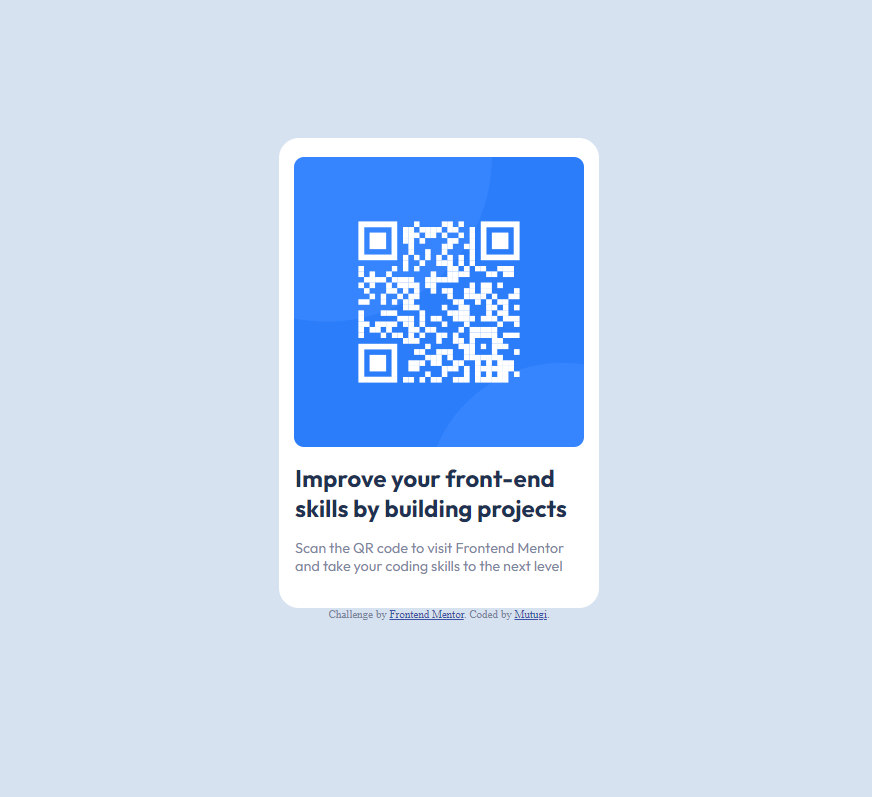

# Frontend Mentor - QR code component solution

This is a solution to the [QR code component challenge on Frontend Mentor](https://www.frontendmentor.io/challenges/qr-code-component-iux_sIO_H).

- [Screenshot](#screenshot)
- [Links](#links)
- [Author](#author)

### Links

- Solution URL: [https://www.frontendmentor.io/solutions/html-5-css-X8WCb99y49]
- Live Site URL: [https://main-qr-code-component.netlify.app/

### Built with

- HTML5
- CSS
- Flexbox
- CSS Grid
- Mobile-first workflow
